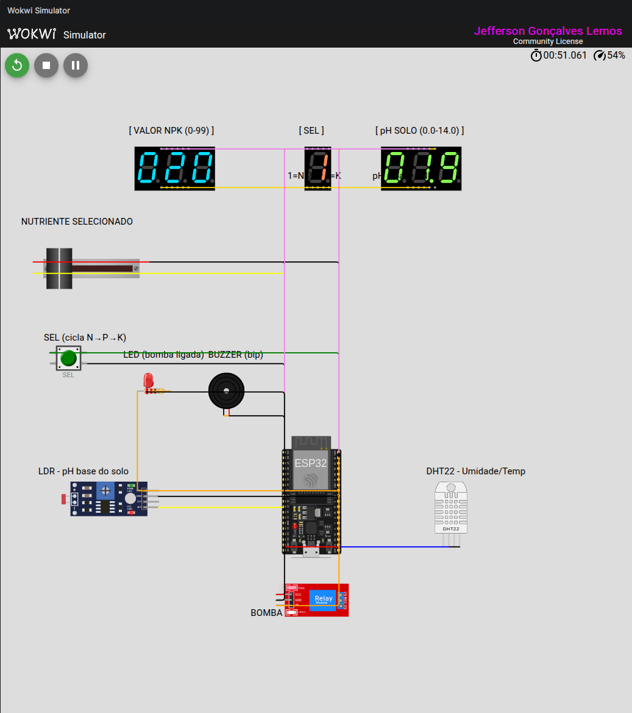

# FarmTech Solutions — Tarefa 1 · Fase 2 · Capítulo 2

**Aluno:** Jefferson Gonçalves Lemos · **RM:** 572399
**Pasta-entrega:** `JeffersonGoncalvesLemos_RM572399_fase2_cap2/esp32`

Sistema de irrigação inteligente baseado em ESP32 que decide ligar ou desligar
a bomba d'água de acordo com **NPK**, **pH** e **umidade do solo**, voltado à
cultura de **soja**.

---

## Vídeo demonstrativo (≤ 5 min, unlisted)

> <!-- TODO: colar link do YouTube após gravação -->
> `https://youtu.be/PREENCHER_APOS_UPLOAD`

---

## Circuito no Wokwi



O arquivo [`diagram.json`](diagram.json) é o projeto Wokwi completo.
Abra em <https://wokwi.com> e cole o conteúdo de [`sketch.ino`](sketch.ino)
— ou use a extensão **Wokwi for VS Code** apontando para [`wokwi.toml`](wokwi.toml).

### Componentes e pinagem

| Componente                      | Pino ESP32 | Papel                                                            |
|---------------------------------|:----------:|------------------------------------------------------------------|
| **Potenciômetro slide**         | `GPIO 34`  | Edita o valor (0–99) do nutriente **NPK** selecionado            |
| **Botão SEL** (INPUT_PULLUP)    | `GPIO 15`  | Cicla o nutriente sendo editado: **N → P → K**                   |
| **LDR** (analógico)             | `GPIO 35`  | pH base do solo (0.0–14.0, antes da adubação)                    |
| **DHT22** (digital)             | `GPIO 18`  | Umidade do solo (%) — assume-se que o DHT22 mede solo (∼ar)       |
| **Relé azul** (IN)              | `GPIO 23`  | Bomba d'água — `HIGH` = bomba **ligada**                          |
| **LED vermelho** (+ 220 Ω)      | `GPIO 19`  | Espelha o relé — luz acesa = bomba ligada                        |
| **Buzzer**                      | `GPIO 33`  | Beep curto na borda **off → on** da bomba                        |
| **Display 7-seg × 3 dígitos**   | seg 25-5   | Mostra o valor do nutriente selecionado (0–99)                   |
| **Display 7-seg × 1 dígito**    | COM 32     | Mostra o índice 1/2/3 (N/P/K) sendo editado                      |
| **Display 7-seg × 3 dígitos**   | COM 2-12   | Mostra o pH atual do solo (X.X) com ponto decimal                |

Alimentação: `3V3` para LDR e DHT22; `5V` para o relé; GND comum.

> **Nota de design.** O enunciado sugere *três botões NPK tudo-ou-nada*. Optamos
> por um **potenciômetro + botão seletor** para permitir valores numéricos
> (0–99) de cada nutriente e exibi-los em displays 7-seg. A regra de irrigação,
> então, leva em conta **faixas** (deficiência, excesso) em vez de booleanos —
> mais realista do ponto de vista agronômico e mais didático na demonstração.

---

## Lógica de decisão da bomba

**Cultura:** soja
**Faixas ideais** (referência agronômica):

| Parâmetro  | Faixa boa      | Crítico inferior | Crítico superior |
|-----------|:--------------:|:----------------:|:----------------:|
| pH        | 5.5 – 6.8      | < 5.5 (ácido)    | > 6.8 (alcalino) |
| Umidade   | 40 – 70 %      | < 40 % (seca)    | ≥ 70 % (saturado)|
| N         | ≤ 30           | —                | > 30 (inibe FBN) |
| P         | ≥ 30           | < 30             | —                |
| K         | ≥ 30           | < 30             | —                |

**Cascata de decisão** (`src/main.cpp:decidirBomba`, `sketch.ino:131`):

1. `isnan(umidade)` → **OFF** (leitura inválida do DHT22)
2. `umidade < 40 %` → **ON** (emergência — solo seco)
3. `umidade ≥ 70 %` → **OFF** (solo saturado — economia)
4. `pH` fora de 5.5–6.8 → **OFF** (corrigir solo antes de regar)
5. `N > 30` → **OFF** (excesso de nitrogênio inibe fixação biológica da soja)
6. `P < 30` **ou** `K < 30` → **OFF** (deficiência nutricional — adubar antes)
7. Caso contrário: regar se `umidade < 60 %` (alvo) — senão **OFF**

O pH é derivado do LDR com correção pelos nutrientes:

```c
pH = pH_base − (N·0.04 + P·0.01 + K·0.005)
```

Isso reflete o efeito acidificante de ureia (N), superfosfato (P) e KCl (K)
sobre o solo — mover o slider NPK muda o pH exibido, simulando na prática o
que o sensor leria após uma aplicação de adubo.

---

## Fluxo de uso (demo)

1. **Boot.** O firmware emite um beep duplo, os 7-seg acendem `020 / 1 / 07.0`
   (N=20, editando N, pH base 7.0).
2. **Edição NPK.** Mova o slider → o dígito do valor muda. Pressione **SEL**
   → índice avança para P (2) e depois K (3).
3. **pH do solo.** Mova o LDR → muda o pH base. Ao mexer no NPK, mexa também
   no LDR (o pH real muda com adubação).
4. **DHT22.** Clique no sensor na UI do Wokwi e altere a umidade (% slider).
   Abaixo de 40 % a bomba liga; acima de 70 %, desliga.
5. **Serial Monitor (115200 baud).** A cada 2 s aparece o estado:
   ```
   Matriz NPK: [N=20  P=45  K=50]  editando: N
   pH:  6.85  |  Umidade:  55.0%  |  Temp:  24.0 C
   → BOMBA LIGADA ▶
   ```

---

## Como rodar

### Opção 1 — Wokwi online (sem instalação)

1. Acesse <https://wokwi.com/projects/new/esp32>.
2. Em **diagram.json**, cole o conteúdo de [`diagram.json`](diagram.json).
3. Em **sketch.ino**, cole o conteúdo de [`sketch.ino`](sketch.ino).
4. Em **Library Manager**, adicione as libs de [`libraries.txt`](libraries.txt):
   - `DHT sensor library` (Adafruit)
   - `Adafruit Unified Sensor`
5. Clique em **▶ Start**. Serial Monitor em **115200 baud**.

### Opção 2 — PlatformIO local (placa ou Wokwi CLI)

```bash
cd esp32
pio run -e esp32dev                  # compila
pio run -e esp32dev -t upload        # flasheia placa física
pio device monitor                   # serial

# ou, via Wokwi CLI (simulação local):
pio run -e esp32dev
wokwi-cli                            # lê wokwi.toml
```

---

## Ir Além — opcionais entregues

### Opcional 1 — Python + OpenWeather (previsão de chuva)

Script: [`../../Cap-2_old/python/clima_openweather.py`](../../Cap-2_old/python/clima_openweather.py)

Consulta a API do OpenWeather e envia ao ESP32, via Serial, uma linha
`CHUVA:<mm>` com a previsão de chuva acumulada nas próximas 24 h. O firmware
(versão integrada) lê a variável e força a bomba a **OFF** quando a previsão
for significativa.

```bash
export OPENWEATHER_API_KEY=<chave>
export OPENWEATHER_CIDADE="Sao Paulo,BR"
export ESP32_PORT=/dev/ttyUSB0   # COM3 no Windows, opcional
python ../../Cap-2_old/python/clima_openweather.py
```

No plano gratuito do Wokwi a porta serial não é exposta — o script, nesse
caso, imprime o comando a ser colado manualmente no Monitor Serial.

### Opcional 2 — Análise estatística em R

Script: [`../../Cap-2_old/r/analise_irrigacao.R`](../../Cap-2_old/r/analise_irrigacao.R)

Lê as leituras simuladas do ESP32 (umidade, pH, NPK, bomba) e roda:

- **Tendência central** — média, mediana de cada variável.
- **Dispersão** — desvio-padrão, IQR.
- **Correlação** — matriz de Pearson entre umidade/pH/NPK e estado da bomba.
- **Regressão logística** — `bomba ~ umidade + pH + N + P + K`, retornando
  os coeficientes e um limiar empírico (P(bomba=1) > 0.5) que pode ser usado
  como regra complementar à cascata determinística acima.

```bash
cd ../../Cap-2_old/r
Rscript analise_irrigacao.R
```

---

## Arquivos

```
esp32/
├── README.md              ← este arquivo
├── sketch.ino             ← versão Wokwi online (one-file)
├── src/main.cpp           ← versão PlatformIO (mesma lógica, com <Arduino.h>)
├── diagram.json           ← circuito Wokwi (parts + connections)
├── platformio.ini         ← build/deps para pio run
├── wokwi.toml             ← config para wokwi-cli / Wokwi VS Code
├── libraries.txt          ← nomes das libs a instalar no Wokwi online
└── docs/
    └── wokwi-circuit.png  ← screenshot do circuito em execução
```

---

## Repositório

Este diretório é um repositório Git independente, incluído como **submodule**
no monorepo `fiap-projetos` (em `1-semestre/Cap-2/esp32/`):

- Repo dedicado: <https://github.com/jeffersonGlemos/cursotiaor-pbl-fase2-esp32>
- Monorepo (contexto): <https://github.com/jeffersonGlemos/fiap-projetos/tree/main/1-semestre/Cap-2/esp32>
